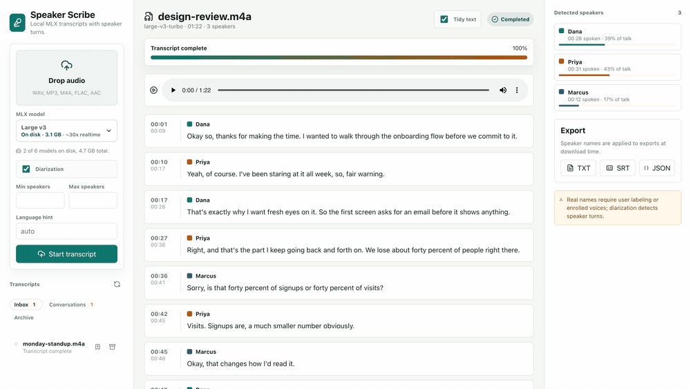

# Speaker Scribe

Speaker Scribe is a local-first web app for turning audio files into transcripts with speaker turns. It uses an Apple Silicon-friendly stack: `mlx-whisper` for Whisper transcription through MLX, and a fully local diarizer built from Silero VAD, SpeechBrain ECAPA speaker embeddings, and clustering. No account, API key, or hosted service is involved.



*Real screenshots of the running app. The conversation is invented — three
fictional people discussing an onboarding flow — because a demo should not ship
somebody's actual recording. Rebuild it with `./scripts/record-demo.sh`.*

## Download

The macOS app is self-contained. It carries its own Python, the speech stack, an
ffmpeg, and enough model weights to transcribe and diarize the first file you
open, so it runs on a Mac with nothing else installed and no network connection.

**[Download the latest release](https://github.com/rogu3bear/speaker-scribe/releases/latest)**
— Apple Silicon, macOS 13 or later.

The `small` Whisper model is included. Larger ones are downloaded from the model
picker inside the app, when you ask for them.

Everything below is for running from source or working on it.

## What It Does

- Upload WAV, MP3, M4A, FLAC, or AAC audio files.
- Run local MLX Whisper transcription with word-level timestamps.
- Optionally run speaker diarization and word-to-speaker assignment, all on-machine.
- Estimate how many speakers are present.
- Let the user rename detected speaker IDs to real names.
- Export TXT, SRT, or JSON transcripts with speaker names applied.

Speaker Scribe cannot infer real human names from arbitrary audio by itself. It detects speaker identities such as `SPEAKER_00`, then lets the user label those identities.

## Stack

- Frontend: Vite, React, TypeScript, lucide-react.
- Backend: FastAPI, Pydantic, uvicorn.
- Speech stack: optional `ml` extra with `mlx-whisper`, `silero-vad`, `speechbrain`, and `scikit-learn`.
- Runtime storage: local `data/` folder with uploaded audio and `jobs.json`.

## Requirements

These are for running from source. The released app needs none of them.

- macOS on Apple Silicon for the intended MLX path.
- `ffmpeg` available on PATH for audio decoding (`brew install ffmpeg`).
- Python 3.11 to 3.13. The `ml` extra is pinned behind `python_version < '3.14'` because the speech stack does not yet publish 3.14 wheels.
- No account or token. Model weights are fetched once from public sources and cached locally.

## Setup

```bash
pnpm install
uv sync --extra test
```

For real MLX transcription:

```bash
brew install ffmpeg
uv sync --extra ml
```

On first run the speaker-embedding model is cached in `~/.cache/speaker-scribe`, which `SPEAKER_SCRIBE_MODEL_CACHE` overrides. Whisper weights are fetched separately into the standard Hugging Face cache, which `HF_HOME` controls.

For a deterministic smoke-test engine that does not download models:

```bash
export SPEAKER_SCRIBE_ENGINE=mock
```

## Run

Start the API:

```bash
uv run uvicorn speaker_scribe_backend.app:app --app-dir backend --host 127.0.0.1 --port 8118 --reload
```

Start the web app:

```bash
pnpm dev
```

Then open `http://127.0.0.1:5178`.

Or run both with:

```bash
./scripts/dev.sh
```

## Check

```bash
./scripts/check.sh
```

This runs frontend type/build/test checks plus backend unit tests against the real
speech stack. Use `SPEAKER_SCRIBE_EXTRA=test ./scripts/check.sh` on a machine that
cannot install it; the ML-gated tests skip rather than fail.

To prove the base install still works on its own, run the suite in an environment with
the `ml` extra removed:

```bash
UV_PROJECT_ENVIRONMENT=build/base-venv uv run --exact --extra test pytest backend/tests -q
```

`UV_PROJECT_ENVIRONMENT` puts that environment somewhere else, so `.venv` keeps
the `ml` extra and a server running against it is unaffected. Without it,
`--exact` strips the speech stack out of the environment in use.

## Packaging

```bash
./scripts/build-app.sh        # builds the runtime and weights first if needed
./scripts/verify-bundle.sh    # proves the result runs offline, on its own
```

See [docs/packaging.md](docs/packaging.md) for what goes into the bundle, why the
runtime is not a virtualenv, and how signing and notarization work.

## Open Source

This repository is MIT licensed. It depends on open-source projects with their own licenses, including `mlx-whisper` under MIT, `silero-vad` under MIT, and `speechbrain` under Apache-2.0.
